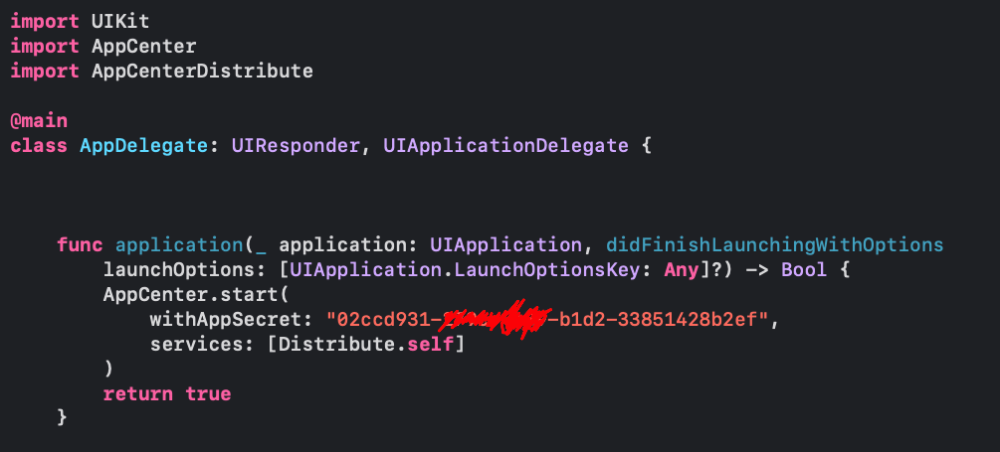
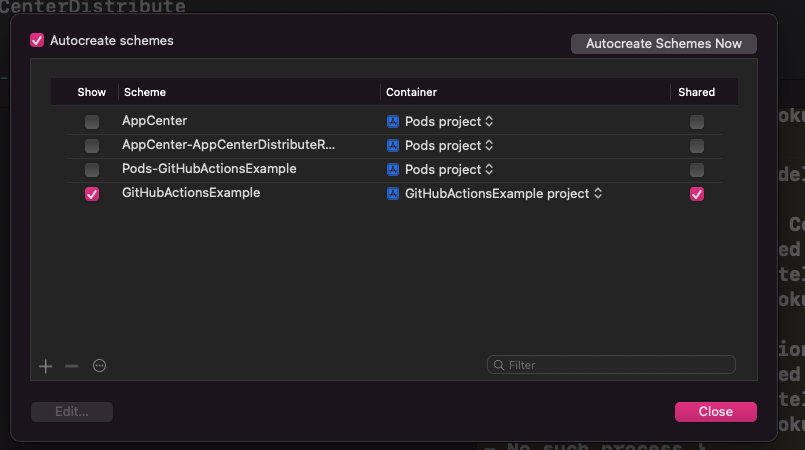
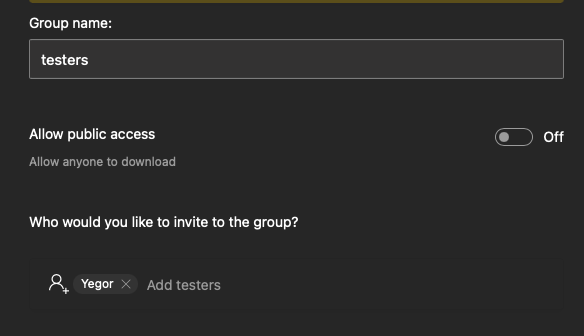
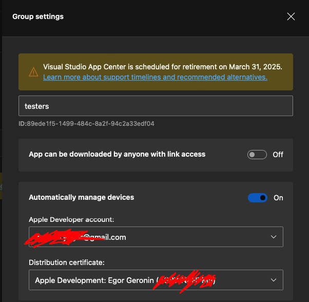
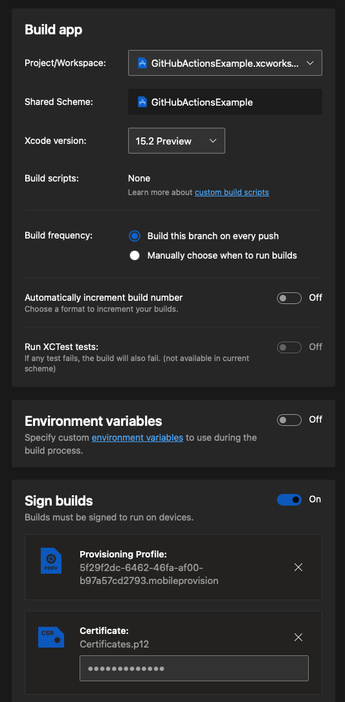

**Важно: AppCenter запланирован к закрытию к 31 марту 2025 года.**

# Настройка AppCenter

Заходить лучше через GitHub. 
Так все нужные репозитории буду подтянуты автоматически.

- Раздел `All app`.

- `add new`

- Новое приложение:
    - OS - iOS
    - Release type - можно выбрать `beta`.
    - Platform - ObjcC/Swift .

После этого вы попадете на страницу `Overview`, где представлена инструкция по интеграции AppCenter-а в ваше приложение. Пока на этом AppCenter можно оставить - мы еще к нему вернемся.

# Работа на стороне Xcode
Создаем приложение / открываем уже существующее. В папке с созданным проектом интегрируем библиотеку AppCenter-а:
- `pod init` (если нужно)
- `open Podfile`
- Интегрируем в Podfile AppCenter и его дочернюю зависимость Distribute (как на скриншоте).

- `pod install`

Открываем xcworkspace. В AppDelegate-е добавляем информацию о дистрибьюции как по инструкции из overview.

Осталось только проверить, что схема вашего проекта помечена как shared (<Target вверху напротив устройства> -> Manage schemes)

*One more thing*. Очень важно подписать наш билд и интеграции, чтобы можно было собраться на реальный девайс. Обязательно запомните, каким аккаунт вы это делаете - нам он еще понадобится.

По классике выгружаем наше творение на GitHub:
- `git add .`
- `git commit`
- `git push`

# Возвращаемся в AppCenter.

Теперь нам нужно выбрать людей, которые будут получать наш билд. Их можно по необходимости даже разбить по группам.
- Раздел `groups`
- Жмакаем `Add Group`
- Вбиваем имена и почты тестеров.

В настройках группы добавляем информацию все о том же аккаунте, которым наше приложение будет подписано. Откуда взять файлы `.p12` и `.cer` [тута](#about_cer):

Теперь отправим этим людям свеженький билд с main ветки.

Для этого отправляемся в раздел Build -> main -> configure build.

- Выбираем наше приложение

- Версию Xcode

- Подписываем билд все теми же сертификатами.

- Выбираем группу которая будет получать информацию об изменениях.

Сохраняем - запускаем. После того, как приложение будет собрано, информация об этом должна упасть всем тестировщикам на почту.

#  О сертификатах и как ими подписывать.

Для сертификата вам нужно залогиниться под Apple id разработчика или в аккаунт, приглашенный в команду.  
После этого заходим в настройки Xcode, раздел Accounts.
Выбираем аккаунт.
Создаем новый или уже нажимаем по существующему сертификату.
Правый клик, export - так вы получите p12.

То же самое, только умнее на [stackoverflow](https://stackoverflow.com/questions/39091048/how-to-convert-a-cer-to-a-p12-file) .
