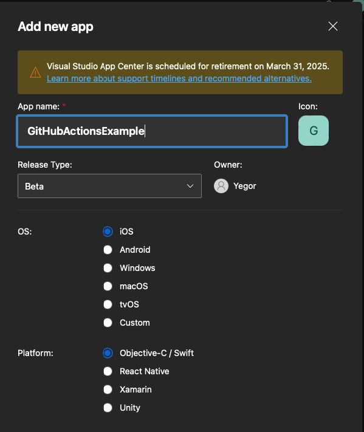
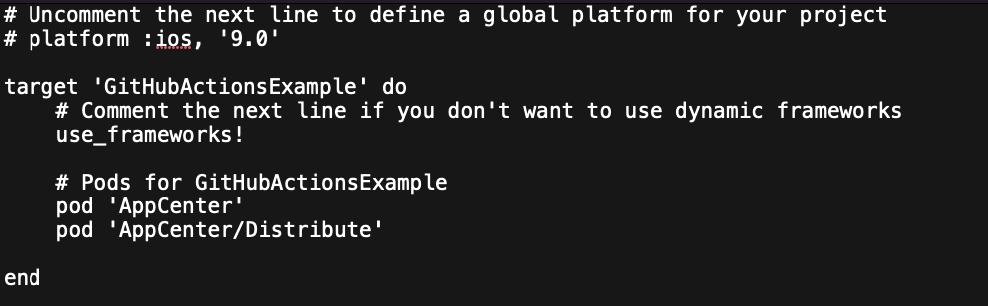

**Важно: AppCenter запланирован к закрытию к 31 марту 2025 года.**

# Настройка AppCenter

Заходить лучше через GitHub. 
Так все нужные репозитории буду подтянуты автоматически.

- Раздел `All app`.

- `add new`

- Новое приложение:
    - OS - iOS
    - Release type - можно выбрать `beta`.
    - Platform - ObjcC/Swift .

После этого вы попадете на страницу `Overview`, где представлена инструкция по интеграции AppCenter-а в ваше приложение. Пока на этом AppCenter можно оставить - мы еще к нему вернемся.

# Работа на стороне Xcode
Создаем приложение / или открываем уже существующее. В папке с созданным проектом интегрируем библиотеку AppCenter-а:
- `pod init` (если нужно)
- `open Podfile`
- Интегрируем в Podfile AppCenter и его дочернюю зависимость Distribute (как на скриншоте).

- `pod install`

Открываем ново (старо) созданный xcworkspace в той же папке. В AppDelegate-е добавляем информацию о дистрибьюции как по инструкции из overview.

  

![[Pasted image 20240511195722.png]]

  

Осталось только проверить, что схема вашего проекта помечена как shared (<Target вверху напротив устройства> -> Manage schemes)

  

![[Pasted image 20240511195914.png]]

  

One more thing. Очень важно подписать наш билд и интеграции, чтобы собраться на реальный девайс. Плюс, нужно запомнить, каким аккаунтом разработчика вы это делаете - нам это еще понадобиться.

  

Загружаем проект на github.

  

# Возвращаемся в AppCenter.

  

Выберем людей, которые будут получать наш билд.

- Заходим в раздел groups

- Выбираем Add Group

- Вбиваем имена и почты тестеров.

  

![[Pasted image 20240511200607.png]]

В настройках группы добавляем информацию все о том же аккаунте, которым наше приложение будет подписано. Откуда взять p12 и cer ниже:

![[Pasted image 20240511203734.png]]

  

Теперь отправим этим людям свеженький билд с main ветки.

Для этого отправляемся в раздел Build -> main -> configure build.

  

Заходим в Build -> GitHub -> Находим наш репозиторий.

Нажимаем на main -> configure build:

- Выбираем наше приложение

- Версию Xcode

- Подписываем билд все теми же сертификатами.

- Выбираем группу которая будет получать информацию об изменениях.

  

![[Pasted image 20240511203856.png]]

  

Сохраняем - запускаем. После того, как приложение будет собрано, информация об этом должна упасть всем тестировщикам на почту.

  

# О сертификатах и как ими подписывать.

  

Для сертификата вам нужно залогиниться под Apple id разработчика, или в аккаунт, приглашенный в команду.

  

После этого заходим в настройки, раздел Accounts.

Выбираем аккаунт.

Создаем новый или уже нажимаем по существующему сертификату.

Правый клик, export - так вы получите p12.
